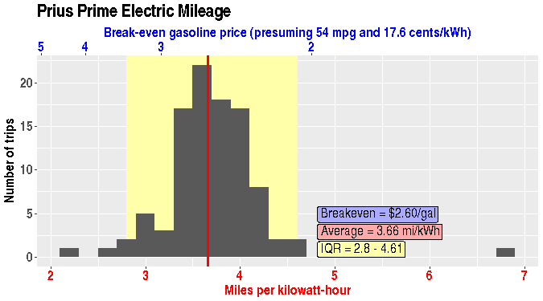

### Mileage Variation

The above plot shows variation in mileage over different trips. The
IQR is the [interquartile range][IQR], and is used here to exclude
outliers (very low or high values, which occur either due to typos or
because I needed to take a second trip before the battery fully
charged - the first trip will seem to have a high mileage, the second
a low one). The average mileage is calculated from only the values in
the IQR.

The "Break even" price is the point at which the cost of using
electricity is identical to the cost of running the car on
gasoline. This is a simplistic measure, in that it does not take into
account differences in maintenance costs of the two power sources,
time costs (driving to a gas station every few weeks
vs. connecting/disconnecting the charger every trip). But I think it's
a valuable comparative value.

[IQR]: https://en.wikipedia.org/wiki/Interquartile_range
